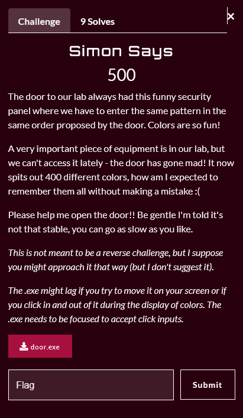
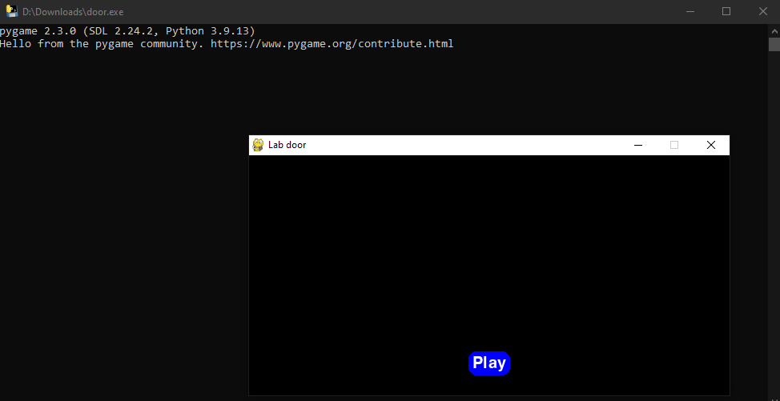
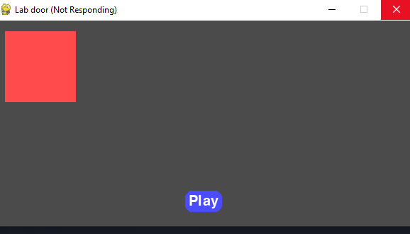
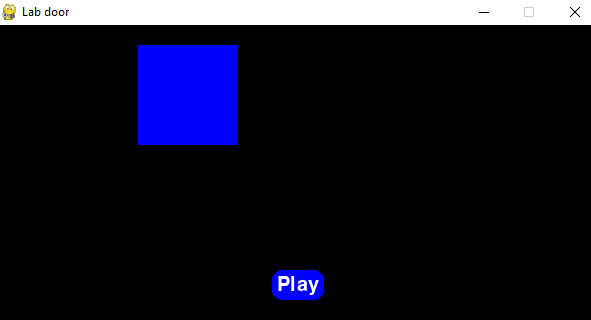
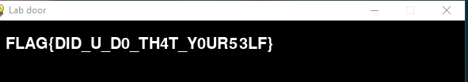

  
----------------------------------------

# 0〤丩ᐯ㇌尺𝓝丩㇄|$

  

------------------------------------------------------------------------------

# Challenge Description:

------------------------------------------------------------------------------



  

# Overview:

------------------------------------------------------------------------------

## Downloadable challenge



We are given an executable file (.exe), and the description says explicitly `this is not a reverse challenge`, so that got me interested.

Upon running, it's obvious that it's an executable made with pygame, so at this point we have two paths:

- We extract the code from the executable using `pyinstxtractor` and `uncompyle6` or similar tools (The easier, more logical solution)
- We run the game and find other ways to exploit this specific case (Very specific, but got me interested)

**So, I went with the second path.. a choice which I will come to semi-regret later**

# Analyzing the application

---------------------------------------------------------

## Prompt
As seen from the challenge description, the application spits out 400 different colors in particular sequence, and we must re-enter the colors in that same sequence so we get the flag.
## Runtime Debugging

*When running the application, we see that it's very inconsistent, it keeps lagging if we move it and crashes without notice, so that was annoying during the test cases*

Once we press play, the application starts spitting out the colors, it has 4 colors, Red Blue Yellow and Green, in a grid format as shown in the picture:





  
And so on...

# Plan of attack:

------------------------------------------------------------------------------

- One idea I had was to record the application window, write a script to split the video into frames, and analyze each frame to get the dominant color, add it to a list and then re-input items in the list as mouse-clicks on given screen coordinates.
- **This idea seemed very new to me as I've never done anything similar to it before, and had no idea where to start, we were low on time aswell but I decided to go through with it. Writing the script proved to be more frustrating with the time-crunch than expected**

# Scripting:

------------------------------------------------------------------------------
## Disclaimer: 

This script is very unsanitized and draft-like, it was written in a time-crunch and might not be optimal/borderline unreadable, and the approach to solving problems that arise on execution was made with speed more than care. It is also not 100% automated, I did some things manually to save time, though if I had more time to write it out, it can be 100% automatic. 

## Research

As I've never done anything like this using python before, I needed to do some research first to find which modules would prove helpful, I found the following modules:

### ColorThief

This module helped tremendously, I used it to get the dominant color/color palette of each frame, for further analysis.

### matplotlib.pyplot

Used this one to plot the dominant colors for debugging purposes while writing the script

### pynput

Used the `mouse` method, to re-input the  clicks in sequence, to given coordinates and to find the coordinates aswell. 

You can read more about each module [here](https://pypi.org)

## Writing the script:

A few unexpected issues kept breaking the script on runtime, some of them are:

- The `play` button kept interfering with the color palettes, so the video had to be cropped before being split into frames
- Each color is not on for exactly 1 frame, so we needed to check if the last item in the list is the same color as the current frame before appending. (The same color cannot be clicked twice in a row)
- The black background kept interfering with the `Blue` frames for some reason, so we had to apply a check for that to exclude the black color from the palettes
- Empty frames (timing issue), so we also had to exclude those
- The colors are not consistent, let's say a frame with `Green` pressed numbered `frame013.png` had the RGB value (0,253,0), there's a chance that `frame450.png` for example will have the green color as RGB (0,250,0), so we had to do some conversions to `int` to be able to actually compare the color and decide which color it is. I wrote exact values for each color which is something you shouldn't do, but it was faster than finding a range for each color

# The final script:

```python
# 0〤丩ᐯ㇌尺𝓝丩㇄|$ # 
from colorthief import ColorThief  
from time import sleep  
import matplotlib.pyplot as plt  
import matplotlib.colors as colors  
from pynput import mouse  
  
  
bot_mouse=mouse.Controller()        # Initialising the mouse to be controlled  
blue_square=(174,112)               # Got the coordinates manually using the get_coordinates function  
yellow_square=(195,218)  
green_square=(55,224)  
red_square=(53,90)  
  
sequence=['R']                      # You have to put the first color of the first frame in the list, otherwise it'll run into an 'index out of range' error  
run=True  
def get_coordinates(x,y):  
    print(f'Now at: {x},{y}')  
  
print('Starting analysis...')  
  
  
for i in range(108,1320):          # Range decided by my file names, the record was too long and the first 107 frames were only black so I excluded them to save time  
    if i < 100:  
        filename=f'frame0{i}.png'  
    else:  
        filename=f'frame{i}.png'  
    ct = ColorThief(filename)  
    palette=ct.get_palette(color_count=2)  
# print(str(palette[0]))  
    if (4,4,243) in palette:     # The RGB value is for the blue color, as it kept having an issue with identifying it  
        palette=[(4,4,243)]  
    else:  
        palette = [color for color in palette if not str(color).startswith("(4, 4") and not str(color).startswith("(8, 4")]         # Excluding black color from the palette  
    if len(palette)==0:                                                         # If the palette is empty (e.g the frame only has black and it was exluded from the step before) then we skip the frame  
        continue  
    hex_value = f"{palette[0][0]:02x}{palette[0][1]:02x}{palette[0][2]:02x}"                    # Converting the RGB value to hex, and then to int to be able to do comparisons  
    int_value=int(hex_value,16)  
    if int_value==1374980 or int_value==1309444 or int_value==1309445 :  
        # print('Green')  
        if sequence[-1] != 'G':  
            sequence.append('G')  
    elif int_value==263411:  
        # print('Blue')  
        if sequence[-1] != 'B':  
            sequence.append('B')  
    elif int_value==16448268 or int_value==16448267 or int_value==16513803:  
        # print('Yellow')  
        if sequence[-1] !='Y':  
            sequence.append('Y')  
    elif int_value==14877700:  
        # print('Red')  
        if sequence[-1] !='R':  
            sequence.append('R')  
    else:  
        print('Not found', int_value)                        # Helps us find undefined int values, and look up if it's a legit color, then add it to our comparisons  
  
print('Analysis done... starting procedure')  
print(sequence)  
prompt=input('> Do you want to continue?')                  # Pauses the script after printing the sequence so we can make sure manually if it lines up with our frames (for checking purposes)  
if prompt=='y':  
    for color in range(len(sequence)):  
        if sequence[color]=='R':  
            bot_mouse.position=red_square  
            bot_mouse.click(mouse.Button.left,1)  
            sleep(1)                                    # If the mouse gives input too fast the program crashes for some reason  
        elif sequence[color]=='B':  
            bot_mouse.position=blue_square  
            bot_mouse.click(mouse.Button.left,1)  
            sleep(1)  
        elif sequence[color]=='G':  
            bot_mouse.position=green_square  
            bot_mouse.click(mouse.Button.left,1)  
            sleep(1)  
        elif sequence[color]=='Y':  
            bot_mouse.position=yellow_square  
            bot_mouse.click(mouse.Button.left,1)  
            sleep(1)  
else:  
    exit()
```

# Alternative solution:

This is the first option from the paths I listed above, I got it from discord after the competition ended.

```bash 
python pyinstxtractor-ng/pyinstxtractor-ng.py door.exe >/dev/null 2>&1; pycdc door.exe_extracted/main.pyc 2>/dev/null | sed -n "s/^.*base64.b64decode('\([^']*\)').*$/\1/p" | base64 -d
```

# The flag:



------------------------------------------------------------------------------