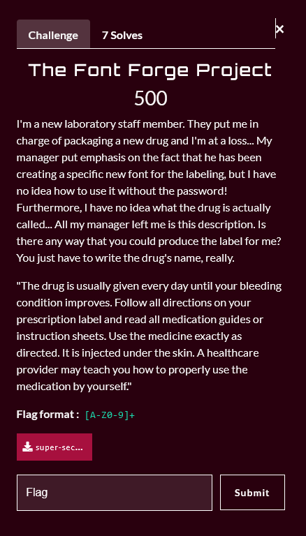
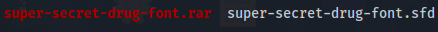
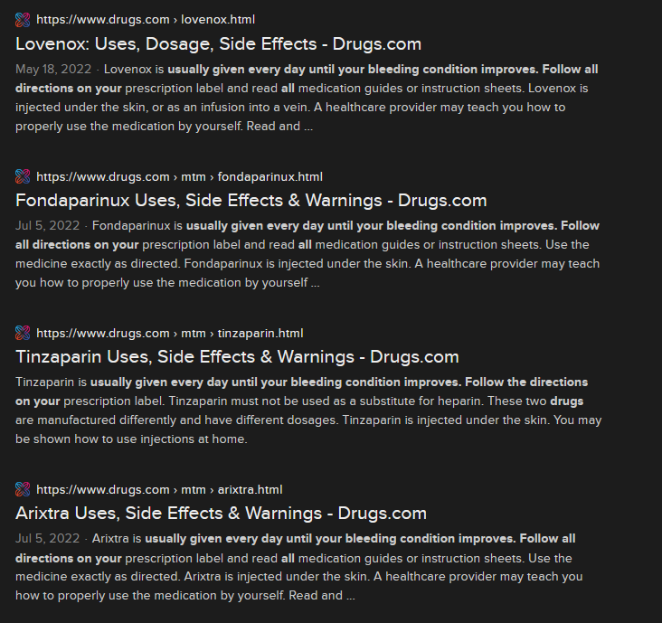
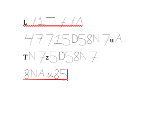

  
----------------------------------------

# 0〤丩ᐯ㇌尺𝓝丩㇄|$

  

------------------------------------------------------------------------------

  
  

# Challenge Description:

------------------------------------------------------------------------------

  

# Overview:

------------------------------------------------------------------------------

## Downloadable challenge

When downloading the provided files, we are given a rar, and when extracting it, we get a 'super-secret-drug-font.sfd'. As I have never seen the .sfd file extension before, I had to do some research.. which led me to [this](https://en.wikipedia.org/wiki/FontForge) wikipedia page.

  
# Plan of attack:

------------------------------------------------------------------------------

- So now everything seems clear.. we get the name of the drug that's described in the challenge prompt, type it out using the font and that should be our flag!
---------------------------------------------

There's a small hiccup though, we first need to convert the .sfd file to a .ttf (TrueType Font ) or a .otf (OpenType Font), so that we can use it inside MS-Word (chosen because it's easily accessible) 

  
  

# Exploitation:

------------------------------------------------------------------------------

## Converting the font type:

We can do that using the `fontforge` tool on linux, issuing the following command:

`fontforge -lang=ff -c 'Open($1); Generate($2)' super-secret-drug-font.sfd super-secret-drug-font.ttf`

## Looking for the drug name: 
We just copy-paste the description of the drug, and we get a couple of candidates

We get a few candidates, so we have to try them all:

After trying them all, we get that `Fondaparinux` is the final flag, which is the second entry in our candidates.
## The flag:

`47715D58N7UA`

------------------------------------------------------------------------------